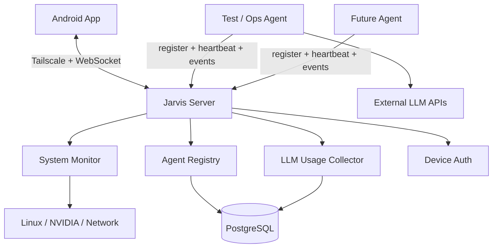

# Jarvis 里程碑 1：Always-On Personal Cloud

> Milestone ID：M1  
> 目标：完成第一个真正可用的 Jarvis 骨架  
> 原则：**不追求功能多，先证明“服务端长期在线 + 手机随时连接 + 系统/Agent/LLM 状态可观测”成立。**

---

## 1. 里程碑目标

完成以下四项能力：

1. **服务端 Jarvis 服务常态启动**
2. **Android App 随时连接服务端**
3. **Android App 可查看服务端 IPv6 与系统状态**
4. **Android App 提供智能体监控页面**
   - 在线 Agent
   - Agent 状态
   - Agent 当前任务
   - Agent 使用的 API Provider / Model
   - 各 Provider 的 LLM Token 用量
   - 请求数、错误数、预估费用

本里程碑完成后，即使 AI Agent 功能尚未完整，Jarvis 已经具备：

> **Always-on Server + Always-reachable App + Realtime Monitoring**

---

## 2. M1 明确不做

M1 不做：

- Immich 接入
- 智能家居
- 量化交易
- 视频工作流
- Service Factory
- Architecture Governor 完整版本
- 动态生成服务
- Temporal
- ClickHouse
- Vault
- 多用户
- 完整权限体系
- 本地 LLM
- 完整 NATS/JetStream 事件总线

目标是让第一个里程碑足够小、可完成、可稳定运行。

---

## 3. 总体架构



### M1 强制简化

第一版建议只有：

```text
Host
├── Tailscale
├── K3s
└── NVIDIA Driver

K3s
├── jarvis-server
└── postgres
```

不要为了“架构漂亮”提前拆成多个微服务。

`jarvis-server` 内部包含：

- HTTP API
- WebSocket Gateway
- System Monitor
- Agent Registry
- LLM Usage
- Device Auth
- Health

M2 再考虑拆 Gateway / Event Bus。

---

## 4. 网络方案

当前约束：

- 服务器公网 IPv6 会变化；
- 没有域名；
- 不希望购买域名；
- 仅个人访问。

因此 M1 使用：

**Tailscale**

Android 和服务器加入同一个 Tailnet。

Android App 保存：

```text
jarvis_server = Tailscale IP / MagicDNS hostname
```

例如：

```text
100.80.x.x
```

App 不依赖公网 IPv6 地址来连接服务器。

但 App **必须展示当前公网 IPv6**，因为它属于服务器系统状态，也为未来 IPv6 直连与网络诊断保留信息。

---

## 5. 服务端公网 IPv6 采集

System Monitor 返回：

```json
{
  "network": {
    "public_ipv4": null,
    "public_ipv6": "240e:xxxx:xxxx::xxxx",
    "tailscale_ipv4": "100.80.x.x",
    "tailscale_ipv6": "fd7a:115c:a1e0::...",
    "lan_ipv4": "192.168.1.10",
    "interfaces": []
  }
}
```

### 5.1 第一优先：本机接口识别

读取 Linux 网络接口，过滤：

- loopback
- link-local
- deprecated
- temporary / privacy address（默认不选）
- Docker / CNI 虚拟地址

优先：

- `scope global`
- `preferred_lft > 0`
- 指定物理网卡
- 稳定地址

### 5.2 第二优先：公网出口确认

后续可以增加外部 IPv6 echo 服务，对本机识别结果进行确认。

M1 可以先不依赖外部服务。

### 5.3 IPv6 变化事件

System Monitor 定期比较：

```text
previous_public_ipv6
current_public_ipv6
```

发生变化：

```text
network.public_ipv6.changed
```

并实时推送到 Android。

---

## 6. System Monitor

M1 至少采集：

```yaml
server:
  hostname:
  os:
  kernel:
  uptime_seconds:

cpu:
  model:
  usage_percent:
  load_1m:
  load_5m:
  load_15m:
  temperature_c:

memory:
  total_bytes:
  used_bytes:
  available_bytes:
  usage_percent:

disks:
  - mount:
    total_bytes:
    used_bytes:
    free_bytes:
    usage_percent:

gpu:
  model:
  utilization_percent:
  memory_total_bytes:
  memory_used_bytes:
  temperature_c:

network:
  public_ipv4:
  public_ipv6:
  tailscale_ipv4:
  tailscale_ipv6:
  lan_ipv4:

jarvis:
  version:
  server_status:
  db_status:
```

### GPU

RTX 5070 通过：

```text
nvidia-smi
```

读取利用率、显存和温度。

---

## 7. System API

### GET /api/v1/health

返回：

```json
{
  "status": "healthy",
  "version": "0.1.0"
}
```

### GET /api/v1/system/status

返回完整系统状态。

### WebSocket Event

```text
system.status.changed
network.public_ipv6.changed
```

---

## 8. Agent Registry

M1 不要求先确定最终 Agent Framework。

先定义 Jarvis 自己的 Agent Presence Protocol。

任何 Agent 只要满足这个协议，就可以被监控。

### 8.1 Agent 注册

```json
{
  "type": "request",
  "topic": "agent.register",
  "payload": {
    "agent_id": "ops-agent",
    "name": "Ops Agent",
    "runtime": "custom",
    "version": "0.1.0",
    "capabilities": [
      "system.analyze"
    ]
  }
}
```

### 8.2 Heartbeat

```json
{
  "type": "event",
  "topic": "agent.heartbeat",
  "payload": {
    "agent_id": "ops-agent",
    "status": "running",
    "provider": "openai",
    "model": "model-name",
    "task_id": "task-001",
    "timestamp": "2026-09-07T12:00:00Z"
  }
}
```

---

## 9. Agent 状态

枚举：

```text
starting
online
idle
running
waiting
error
degraded
offline
```

建议默认判断：

```text
last_seen <= 30 秒
→ online/running/idle

last_seen > 30 秒
→ degraded

last_seen > 90 秒
→ offline
```

阈值配置化。

---

## 10. Agent 数据模型

### agents

```sql
CREATE TABLE agents (
    id              TEXT PRIMARY KEY,
    name            TEXT NOT NULL,
    runtime         TEXT,
    version         TEXT,
    status          TEXT NOT NULL,
    provider        TEXT,
    model           TEXT,
    current_task_id TEXT,
    last_seen_at    TIMESTAMPTZ,
    created_at      TIMESTAMPTZ NOT NULL DEFAULT now(),
    updated_at      TIMESTAMPTZ NOT NULL DEFAULT now()
);
```

### agent_sessions

```sql
CREATE TABLE agent_sessions (
    id          UUID PRIMARY KEY,
    agent_id    TEXT NOT NULL,
    provider    TEXT,
    model       TEXT,
    status      TEXT,
    started_at  TIMESTAMPTZ NOT NULL,
    ended_at    TIMESTAMPTZ
);
```

### agent_events

```sql
CREATE TABLE agent_events (
    id          BIGSERIAL PRIMARY KEY,
    agent_id    TEXT NOT NULL,
    event_type  TEXT NOT NULL,
    task_id     TEXT,
    payload     JSONB,
    created_at  TIMESTAMPTZ NOT NULL DEFAULT now()
);
```

M1 可以设置事件保留期限，避免无限增长。

---

## 11. Agent API

```text
GET /api/v1/agents
GET /api/v1/agents/{agentId}
GET /api/v1/agents/{agentId}/events
```

WebSocket：

```text
agent.register
agent.heartbeat
agent.status.changed
agent.task.started
agent.task.finished
agent.error
```

---

## 12. LLM Usage 采集

所有 Jarvis 管理范围内的 LLM API 调用必须经过统一轻量 Wrapper：

```text
Agent
 ↓
Jarvis LLM Client
 ↓
OpenAI / Anthropic / Google / ...
```

这个 Wrapper 第一阶段不做复杂模型路由，只负责：

1. 发起模型调用；
2. 记录 Provider / Model；
3. 读取响应中的 usage；
4. 记录 latency；
5. 记录成功/失败；
6. 估算 cost；
7. 发布 `llm.request.completed`。

---

## 13. LLM Request 数据模型

```sql
CREATE TABLE llm_requests (
    id                   UUID PRIMARY KEY,
    request_id           TEXT,
    agent_id             TEXT,
    provider             TEXT NOT NULL,
    model                TEXT NOT NULL,

    input_tokens         BIGINT NOT NULL DEFAULT 0,
    output_tokens        BIGINT NOT NULL DEFAULT 0,
    cached_input_tokens  BIGINT NOT NULL DEFAULT 0,
    reasoning_tokens     BIGINT NOT NULL DEFAULT 0,

    latency_ms           INTEGER,
    status               TEXT NOT NULL,
    error_type           TEXT,

    estimated_cost_usd   NUMERIC(18,8),

    started_at           TIMESTAMPTZ NOT NULL,
    finished_at          TIMESTAMPTZ
);
```

建议索引：

```sql
CREATE INDEX idx_llm_requests_started_at
ON llm_requests(started_at);

CREATE INDEX idx_llm_requests_provider_model
ON llm_requests(provider, model);

CREATE INDEX idx_llm_requests_agent
ON llm_requests(agent_id);
```

---

## 14. Token 统计数据来源

### 第一优先：API Response Usage

每次模型调用完成后，从供应商响应读取：

```text
input_tokens
output_tokens
cached_tokens
reasoning_tokens
```

供应商不支持的字段记为 0 / null。

优点：

- 实时
- 与 Agent 请求直接关联
- 不依赖 Billing API

### 第二阶段：Provider Billing API 对账

不属于 M1。

---

## 15. Cost 估算

建立本地价格表：

```yaml
providers:
  provider-name:
    model-name:
      input_per_million: 0
      output_per_million: 0
      cached_input_per_million: 0
      valid_from: "2026-01-01"
```

每次请求完成时将**当时的预估费用直接写入请求记录**。

不要未来按照最新价格重新计算历史费用。

---

## 16. LLM Usage API

### GET /api/v1/llm/usage

Query：

```text
range=today
group_by=provider
```

支持：

```text
today
7d
30d
month
custom
```

支持 group：

```text
provider
model
agent
```

返回示例：

```json
{
  "range": "today",
  "total": {
    "input_tokens": 1200000,
    "output_tokens": 230000,
    "cached_input_tokens": 410000,
    "requests": 301,
    "errors": 2,
    "estimated_cost_usd": 4.81
  },
  "providers": []
}
```

---

## 17. Jarvis WebSocket M1 协议

连接：

```text
ws://<tailscale-address>:<port>/ws
```

后续加 TLS 时变成：

```text
wss://...
```

统一 envelope：

```json
{
  "id": "uuid",
  "type": "request",
  "topic": "system.status.get",
  "timestamp": "2026-09-07T12:00:00Z",
  "payload": {}
}
```

Response：

```json
{
  "id": "uuid",
  "type": "response",
  "reply_to": "uuid",
  "topic": "system.status.get",
  "payload": {}
}
```

Event：

```json
{
  "id": "uuid",
  "type": "event",
  "topic": "system.status.changed",
  "payload": {}
}
```

---

## 18. M1 Topic

### Gateway

```text
gateway.ping
gateway.pong
gateway.status
```

### System

```text
system.status.get
system.status.changed
network.public_ipv6.changed
```

### Agent

```text
agent.register
agent.list
agent.get
agent.heartbeat
agent.status.changed
agent.task.started
agent.task.finished
agent.error
```

### LLM

```text
llm.usage.summary
llm.usage.changed
llm.request.completed
```

---

## 19. Android App 页面结构

M1 只做四个主要页面：

```text
Home
Server
Agents
LLM Usage
```

底部 Navigation：

```text
Home | Server | Agents | AI
```

---

## 20. Home 页面

参考：

```text
┌──────────────────────────────┐
│ Jarvis               ONLINE  │
│                              │
│ Server        Healthy        │
│ Agents        2 Online       │
│ LLM Today     1.82M tokens   │
│ Public IPv6   240e:...       │
│                              │
│ Gateway Latency   24 ms      │
│ Server Uptime     12d 4h     │
└──────────────────────────────┘
```

首页只展示“现在是否正常”。

不堆详细指标。

---

## 21. Server 页面

### Header

```text
JARVIS SERVER
● ONLINE
```

### Network Card

```text
Public IPv6
240e:xxxx:xxxx::xxxx

Tailscale
100.xx.xx.xx

LAN
192.168.1.10
```

### CPU

- utilization
- load
- temperature

### Memory

- used / total
- percent

### Storage

- used / total
- percent

### GPU

```text
RTX 5070

Utilization
VRAM
Temperature
```

### Jarvis Services

```text
Jarvis Server    Healthy
PostgreSQL       Healthy
```

---

## 22. Agents 页面

顶部统计：

```text
Online    2
Running   1
Idle      1
Error     0
```

卡片：

```text
Ops Agent
● ONLINE

Status
Running

Task
Analyze system health

Runtime
Custom

Model
OpenAI / xxx

Last Seen
2s ago
```

点击进入 Agent Detail。

---

## 23. Agent Detail

展示：

```text
Identity
Status
Current Task
Runtime
Version
Provider
Model
Session Start
Last Seen
```

以及：

```text
Token Today
Requests Today
Errors Today
Estimated Cost
```

下面是最近 Event Timeline。

---

## 24. LLM Usage 页面

顶部：

```text
Today

Total Tokens
1.82M

Estimated Cost
$7.34

Requests
482
```

Provider 卡片：

```text
OpenAI

Input      1.20M
Output     230K
Cache      410K
Requests   301
Errors     2
Cost       $4.81
```

下面显示其他 Provider。

时间范围：

```text
Today | 7D | 30D | Month
```

后续可以增加折线图。

---

## 25. Android 技术栈

- Kotlin
- Jetpack Compose
- Material 3
- Coroutines
- Kotlin Serialization
- OkHttp WebSocket
- Room
- DataStore
- Navigation Compose

架构：

```text
Compose UI
   ↓
ViewModel
   ↓
Repository
   ↓
GatewayClient / ApiClient
   ↓
Jarvis Server
```

Room 只作为最近状态缓存。

Server 始终是事实源。

---

## 26. Android Connection State

状态：

```text
connecting
online
reconnecting
offline
unauthorized
```

必须支持：

- App 启动自动连接；
- App 前台自动重连；
- Wi-Fi → 5G 自动重连；
- 5G → Wi-Fi 自动重连；
- Server reboot 后自动恢复；
- 指数退避；
- Heartbeat timeout。

---

## 27. Realtime 更新策略

Server 内部采样：

### CPU / RAM / GPU

```text
2 秒一次
```

### Disk

```text
10 秒一次
```

### Network

```text
5 秒一次
```

不要所有采样都无脑推到手机。

建议：

```text
采样
→ 更新 Server State
→ 判断变化
→ 根据订阅状态推送
```

App 在相关页面前台时高频订阅。

App 后台只接收重要事件。

---

## 28. 服务常态启动

M1 K3s：

```text
Deployment: jarvis-server
StatefulSet/Deployment: postgres
```

`jarvis-server`：

- restart always
- readiness probe
- liveness probe
- resource request/limit
- stdout structured log

启动链：

```text
Server Power On
→ Linux
→ Tailscale
→ K3s
→ PostgreSQL
→ Jarvis Server
→ Android reconnect
```

整个过程不要求人工登录服务器。

---

## 29. Health

### /health/live

只判断进程是否活着。

### /health/ready

检查：

- PostgreSQL
- System Monitor
- Internal Scheduler

返回：

```json
{
  "status": "healthy",
  "components": {
    "database": "healthy",
    "system_monitor": "healthy"
  }
}
```

---

## 30. M1 身份认证

因为：

- 单用户
- Tailscale 私网
- 原型阶段

M1：

```text
Tailscale Private Network
+
Device Token
```

首次绑定：

```text
Android 生成随机 Device ID
→ 用户输入/扫描一次性 pairing code
→ Server 创建 Device Token
→ App 保存到 Android Keystore/DataStore
```

后续请求：

```text
Authorization: Bearer <device-token>
```

M2 再升级：

- Device asymmetric key
- Android Keystore
- Challenge Signature
- Biometric Approval

---

## 31. Monorepo

推荐：

```text
jarvis/
├── apps/
│   ├── server/
│   └── android/
│
├── packages/
│   ├── protocol/
│   ├── system-monitor/
│   ├── agent-registry/
│   ├── llm-usage/
│   └── common/
│
├── deploy/
│   └── k8s/
│
├── docs/
└── tests/
```

第一阶段不要拆多个 Git Repo。

---

## 32. Server 内部模块

```text
jarvis-server
├── api
├── websocket
├── auth
├── health
├── system
├── network
├── agents
├── llm
├── persistence
└── scheduler
```

模块之间通过明确 interface 调用。

不要创建：

```text
utils2
misc
helpers
common-new
```

---

## 33. 开发顺序

### Step 1 — Server Skeleton

完成：

- Server Boot
- `/health`
- PostgreSQL
- logging
- WebSocket

验收：

```text
服务重启后自动恢复
```

### Step 2 — System Monitor

完成：

- CPU
- RAM
- Disk
- GPU
- IPv6
- Tailscale IP
- uptime

验收：

```text
GET /api/v1/system/status
```

返回完整 JSON。

### Step 3 — Android Connection

完成：

- Server 地址配置
- Device Token
- WebSocket
- reconnect
- heartbeat
- connection state

验收：

```text
Wi-Fi → 5G → Wi-Fi
```

能自动恢复。

### Step 4 — Server UI

完成：

- Home
- Server

验收：

手机实时看到：

- CPU
- RAM
- GPU
- IPv6
- Uptime

### Step 5 — Agent Registry

创建 Dummy Agent：

```text
test-agent
```

每 10 秒发送 heartbeat。

验收：

```text
Online → Degraded → Offline
```

App 实时变化。

### Step 6 — LLM Usage

实现统一 LLM Client Wrapper。

第一阶段只接一个 Provider 也可以。

验收：

发起模型调用后：

```text
Token / Request / Cost
```

自动增长。

### Step 7 — Agent Monitor UI

完成：

- Agent List
- Agent Detail
- Current Task
- Provider
- Model
- Last Seen
- Token Usage

### Step 8 — 稳定性

测试：

```text
Server reboot
K3s restart
Jarvis Server crash
PostgreSQL restart
Wi-Fi/5G switching
Tailscale reconnect
Agent crash
LLM timeout
```

---

## 34. 测试要求

### Unit

- IPv6 address selector
- Agent timeout state machine
- Token aggregation
- Cost calculation
- Message envelope validation

### Integration

- PostgreSQL
- WebSocket
- Agent register/heartbeat
- LLM request logging

### End-to-End

```text
Android
→ Gateway
→ Server
→ DB
→ Event
→ Android UI
```

---

## 35. M1 验收清单

### 服务端

- [ ] 开机后 Jarvis 自动启动
- [ ] Jarvis 崩溃后自动重启
- [ ] PostgreSQL 自动启动
- [ ] `/health/live` 正常
- [ ] `/health/ready` 正常
- [ ] WebSocket 正常

### 网络

- [ ] Android 不依赖固定公网 IP
- [ ] Android 通过 Tailscale 随时连接
- [ ] App 显示服务器公网 IPv6
- [ ] IPv6 变化后 App 自动更新

### System Monitor

- [ ] CPU
- [ ] RAM
- [ ] Disk
- [ ] GPU
- [ ] Temperature
- [ ] Uptime
- [ ] Public IPv6
- [ ] Tailscale IP

### Agent Monitor

- [ ] Register
- [ ] Heartbeat
- [ ] Online
- [ ] Idle
- [ ] Running
- [ ] Degraded
- [ ] Offline
- [ ] Current Task
- [ ] Provider
- [ ] Model

### LLM Usage

- [ ] Provider
- [ ] Model
- [ ] Input Token
- [ ] Output Token
- [ ] Cached Token（支持时）
- [ ] Reasoning Token（支持时）
- [ ] Request Count
- [ ] Error Count
- [ ] Cost Estimate
- [ ] Today
- [ ] Month

### Android

- [ ] Home
- [ ] Server
- [ ] Agents
- [ ] Agent Detail
- [ ] LLM Usage
- [ ] 自动重连
- [ ] 实时状态更新

---

## 36. M1 Demo Script

1. 手机使用 5G 打开 Jarvis；
2. App 显示 `ONLINE`；
3. 查看服务器当前公网 IPv6；
4. 查看 CPU / RAM / RTX 5070 / Storage；
5. 打开 Agents；
6. 显示 `test-agent ONLINE`；
7. 启动一次测试 LLM 请求；
8. Agent 变为 `RUNNING`；
9. LLM Token 数实时增加；
10. 请求完成后 Agent 回到 `IDLE`；
11. 停止 Agent；
12. App 在超时后显示 `DEGRADED` → `OFFLINE`；
13. 重启服务器；
14. Jarvis 自动恢复；
15. 手机自动重新连接；
16. IPv6 若发生变化，App 不影响连接，但 Network 卡片更新新地址。

---

## 37. Definition of Done

M1 完成时系统应是：

```text
                     Android
                        │
                  Tailscale
                        │
                 persistent WS
                        │
                Jarvis Server
          ┌─────────────┼─────────────┐
          │             │             │
       System        Agents        LLM Usage
       Monitor       Registry       Collector
          │             │             │
          └─────────────┼─────────────┘
                        │
                    PostgreSQL
```

并同时拥有：

- 长期在线
- 随时可达
- 自动重连
- 实时状态
- Agent-aware
- LLM-aware
- 基础持久化
- 最小身份认证

下一里程碑再加入：

```text
Capability Registry
+
NATS / Event Bus
+
Dynamic UI
+
Policy / Approval
+
Audit
```

---

## 38. 一句话定义 M1

> **M1 的目标不是让 Jarvis“聪明”，而是先让它成为一朵真正长期在线、随时可连接、能够感知自身与 AI 运行状态的个人云。**
