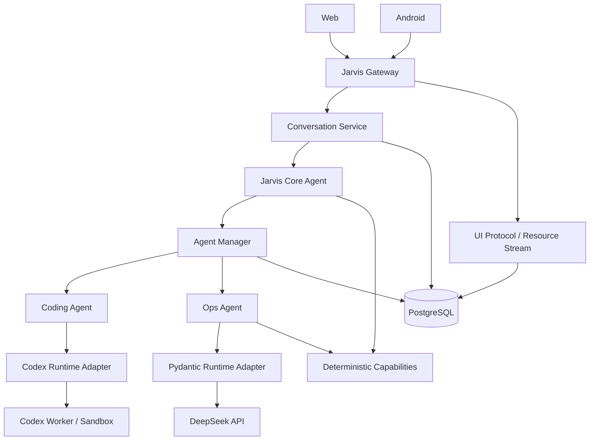

# Jarvis M2：Real Agent + Dynamic Experience

> Milestone ID：M2  
> 版本目标：v0.2.0  
> 前置条件：M1 `Always-On Personal Cloud` 已完成  
> 核心目标：**让用户真正通过 Web / Android 与 Jarvis 对话，并让 Jarvis 在服务端管理、调度和观察真实 Agent；同时建立 Web / Android 共用的动态 UI 协议。**

## 1. 一句话定义

> **M2 要把 Jarvis 从“可以监控 AI 的私人云”升级成“可以与用户持续交互、管理多层 Agent、并通过动态可视化界面呈现任务过程与结果的个人 AI 云操作系统”。**

用户面对的始终只有 `Jarvis`。Codex、DeepSeek、Pydantic AI、Coding Agent、Ops Agent 等全部属于 Jarvis 服务端内部的智能资源。

## 2. 核心产品原则

### 2.1 用户只和 Jarvis 交互

```text
Web / Android
      │
      ▼
Jarvis Conversation
      │
      ▼
Jarvis Core Agent
```

前端不得直接连接 Codex Runtime、Pydantic Agent、DeepSeek Agent 或 Worker Pod。

### 2.2 Jarvis Core Agent 是协调者

职责：

- 理解用户意图
- 判断是否需要 AI
- 判断是否直接调用确定性服务
- 拆分复杂任务
- 选择 Domain Agent
- 发起 Agent Run
- 观察运行状态
- 汇总多个 Agent 结果
- 生成 UI Intent
- 请求必要审批
- 将结果返回用户

Jarvis Core 不应该承担所有代码、研究、运维和媒体处理工作。

### 2.3 Agent 必须分层

```text
L0  Experience Layer
    Web / Android
             │
             ▼
L1  Jarvis Core Agent
    对话 / 理解 / 路由 / 委派 / 汇总
             │
      ┌──────┼──────┐
      ▼      ▼      ▼
L2  Managed Domain Agents
    Coding   Ops   Research ...
      │      │
      └──────┼──────────────┐
             ▼              ▼
L3  Ephemeral Workers / Runs
    Codex Pod / Pydantic Worker / Future Runtime
             │
             ▼
L4  Deterministic Capabilities / Services
```

## 3. Agent 分层要求

### 3.1 Tier 1：Jarvis Core Agent

逻辑上唯一、长期在线。

```yaml
id: jarvis-core
tier: core
lifecycle: long-lived
role: coordinator
```

负责：

- Conversation
- Intent
- Planning
- Delegation
- Coordination
- Result aggregation
- UI Intent
- Approval routing

Jarvis Core 是逻辑身份，不绑定某个模型或 Runtime。

### 3.2 Tier 2：Managed Domain Agents

第一阶段至少实现：

- Coding Agent
- Ops Agent

后续：

- Research Agent
- Quant Agent
- Media Agent
- Home Agent
- Integration Agent
- Architecture Agent

Domain Agent 描述“负责什么领域”，而不是“使用什么模型”。

### 3.3 Tier 3：Worker / Agent Run

真正执行任务的临时实例。

```text
Coding Agent
    │
    ▼
Agent Run #184
    │
    ▼
Temporary K8s Job
    │
    ▼
Codex App Server
```

任务结束后持久化 Result、Diff、Artifacts、Events、Usage，再销毁 Worker。

## 4. Role / Runtime / Model 解耦

M2 必须采用：

```text
Role × Runtime × Model
```

例如：

```yaml
role: coding
runtime: codex
model_provider: openai
model: xxx
```

未来可替换为：

```yaml
role: coding
runtime: opencode
model_provider: deepseek
model: xxx
```

Jarvis Core 不应依赖具体 Runtime 或 Model。

## 5. M2 总体架构



## 6. M2 必须交付的四大能力

### A. Jarvis Conversation

Web 和 Android 都必须支持：

- 新建会话
- 查看会话
- 用户消息
- Jarvis 回复
- Streaming
- 对话历史
- Run 卡片
- UI Intent
- Action
- Approval 协议占位
- 重连后恢复当前状态

### B. Agent Management

Jarvis 必须能：

- register
- start
- assign
- observe
- cancel
- resume
- terminate

并支持：

- Agent Definition
- Agent Instance
- Agent Run
- Parent / Child Run
- 状态
- 事件
- Token
- Tool Call
- Workspace
- Result
- Error
- Cancellation

### C. Real Agent Runtime

必须：

- 接入 Codex Coding Agent

推荐同时完成：

- DeepSeek + Pydantic AI Ops Agent

Codex 是 Agent Runtime / Harness；DeepSeek 是 Model Provider，二者不得混为一层。

### D. Dynamic Experience

Web 与 Android 必须共享：

- Resource State
- ViewSpec
- UI Intent

但分别使用：

- React Renderer
- Compose Renderer

Android 主体验禁止使用 WebView 代替原生 UI。

## 7. M2 明确不做

- Immich 完整接入
- Home Assistant 完整接入
- Quant 实盘
- Service Factory
- Architecture Governor 完整版
- 多用户
- 家庭账户
- 完整 MCP 平台
- 完整 NATS / JetStream
- Temporal
- Kubernetes 自动 GitOps 发布
- Agent 直接生产部署
- Agent 直接控制真实资金
- Agent 获得宿主机 root
- Agent 自由生成任意 React / HTML / JavaScript
- 自由多 Agent 群体自治
- 无限递归 Agent delegation

## 8. Conversation 数据模型

### conversations

```text
id
title
status
created_at
updated_at
```

### conversation_messages

```text
id
conversation_id

role:
  user
  jarvis
  system

content
content_type

run_id
view_id

created_at
```

状态：

```text
active
archived
```

## 9. Agent Definition

新增：

```text
agent_definitions
```

字段：

```text
id
name
tier
role
runtime_type
runtime_config
lifecycle
enabled
description
created_at
updated_at
```

示例：

```yaml
id: coding-agent
name: Coding Agent
tier: managed
role: coding
runtime_type: codex
lifecycle: on-demand
```

## 10. Agent Instance

```text
agent_instances
```

字段：

```text
id
agent_definition_id
runtime_type
runtime_instance_id
status
started_at
last_seen_at
stopped_at
metadata
```

状态：

```text
starting
idle
running
waiting
error
stopping
stopped
offline
```

## 11. Agent Run

M2 的核心新对象：

```text
agent_runs
```

字段：

```text
id
agent_id
agent_instance_id
parent_run_id
conversation_id
requested_by
goal
runtime_type
runtime_run_id
status
workspace_id
input_json
result_json
error_json
started_at
finished_at
created_at
updated_at
```

状态：

```text
queued
starting
running
waiting_for_user
waiting_for_approval
completed
failed
cancelled
```

## 12. Parent / Child Run

M2 必须支持 Run 树：

```text
run-100 Jarvis Core
│
├── run-101 Ops Agent
│
└── run-102 Coding Agent
```

M2 限制：

```text
max delegation depth = 2
```

避免失控递归。

## 13. Agent Runtime Interface

Jarvis 必须建立自己的 Runtime 抽象：

```ts
interface AgentRuntime {
  start(input: AgentRunInput): Promise<RuntimeRun>;
  send(runId: string, input: AgentInput): Promise<void>;
  cancel(runId: string): Promise<void>;
  resume(runId: string, input?: AgentInput): Promise<void>;
  events(runId: string): AsyncIterable<AgentEvent>;
  dispose(runId: string): Promise<void>;
}
```

Jarvis Server 不允许直接依赖：

- Codex JSON-RPC type
- Pydantic internal type
- DeepSeek response type

所有 Runtime-specific 数据必须停在 Adapter 内。

## 14. Runtime Registry

第一版：

```text
AgentRuntimeRegistry
├── codex
└── pydantic
```

提供：

```text
runtime.get(type)
runtime.start(...)
runtime.cancel(...)
runtime.health(...)
```

## 15. Agent Event

所有 Runtime Event 必须归一化。

M2 至少定义：

```text
agent.run.created
agent.run.started
agent.thinking
agent.message.delta
agent.tool.started
agent.tool.completed
agent.tool.failed
agent.progress
agent.waiting_user
agent.approval.required
agent.usage.updated
agent.run.completed
agent.run.failed
agent.run.cancelled
```

示例：

```json
{
  "id": "event-...",
  "run_id": "run-184",
  "agent_id": "coding-agent",
  "type": "agent.tool.started",
  "timestamp": "...",
  "payload": {
    "tool": "shell",
    "title": "运行测试",
    "detail": "npm test"
  }
}
```

前端不能依赖 Runtime 原始输出。

## 16. Codex Coding Agent

架构：

```text
Jarvis
  ↓
Agent Manager
  ↓
Coding Agent
  ↓
Codex Runtime Adapter
  ↓
Codex App Server
  ↓
Sandbox Workspace
```

禁止把长期实现做成：

```text
spawn codex CLI
→ 正则解析 stdout
```

## 17. Coding Agent 权限

允许：

- clone / checkout sandbox repo
- read source
- edit source
- create files
- run build
- run unit test
- run lint
- git status
- git diff

禁止：

- production DB
- host /
- kubectl production
- Docker socket
- Tailscale config
- production secrets
- reboot server
- 直接写生产 Jarvis Repo
- auto merge
- auto deploy

## 18. Coding Workspace

每个 Run 独立：

```text
/workspaces/<run-id>/
```

建议：

```text
git clone
or
git worktree
```

必须支持：

- dirty workspace isolation
- diff export
- artifact export
- cleanup

任务后长期保留的是：

- metadata
- diff
- summary
- test result
- usage

Workspace 本身按 TTL 回收。

## 19. DeepSeek Ops Agent

推荐：

```text
role: ops
runtime: pydantic
provider: deepseek
```

第一阶段全部只读：

- system.status.read
- system.metrics.read
- agent.list
- agent.run.read
- llm.usage.read

禁止：

- restart
- deploy
- delete
- shell
- kubectl

## 20. Jarvis Core Agent 能力

至少：

```text
conversation.respond
agent.list
agent.run.create
agent.run.cancel
agent.run.status
system.status.read
llm.usage.read
ui.view.show
```

M2 不允许 Core Agent：

- arbitrary shell
- direct production mutation
- direct K8s admin

## 21. Jarvis 决策规则

### “CPU 现在多少？”

```text
Conversation
→ deterministic system.status
→ UI
```

不创建 Agent Run。

### “为什么昨晚 CPU 升高？”

```text
Jarvis Core
→ Ops Agent Run
→ result
→ Jarvis
→ UI
```

### “检查 Jarvis 仓库有没有明显问题”

```text
Jarvis Core
→ Coding Agent Run
→ Codex
```

## 22. Web 前端

新增：

```text
apps/web
```

建议：

- React
- TypeScript
- Vite
- shadcn/ui
- Apache ECharts
- WebSocket

不做 SSR。

只在 Tailnet 内访问。

## 23. Web 页面

至少：

```text
首页
Jarvis
智能体
AI 用量
服务器
动态工作台
```

## 24. 中文优先

默认语言：

```text
简体中文
```

要求：

- Navigation 中文
- 状态中文
- Agent 事件中文标题
- 图表标签中文
- Tool 事件有中文 title
- Runtime / Model 品牌名保留原文
- 技术字段只在详情页显示

例如主界面显示：

```text
任务完成
```

而不是：

```text
Agent Run Completed
```

## 25. Design Constitution

```text
图 > 表 > 文字
数据 > 描述
状态 > 长解释
变化趋势 > 单一数值
按需展开 > 全部展示
中文 > 英文
行动按钮 > Markdown 命令
```

## 26. 首页要求

重点回答：

> “Jarvis 现在怎么样？”

以图表和状态为主：

- 系统健康
- 在线 Agent
- 运行中任务
- 今日 Token
- 预估费用
- CPU / GPU 趋势
- 最近任务
- 异常提示

禁止首页堆完整日志和长文本。

## 27. Jarvis 对话页

不是纯聊天 UI。

支持：

- Text
- View
- Run
- Approval
- Action
- Progress
- Diff
- Chart
- Timeline

用户消息与动态图表/任务卡片混合呈现。

## 28. Agent Center

必须体现层级。

第一层：

```text
Jarvis Core
```

第二层：

```text
Managed Agents
```

第三层：

```text
Active Runs
```

禁止 Core / Domain / Worker 全部平铺。

## 29. Agent Run 页面

至少显示：

- 当前状态
- 进度
- 运行时间
- Runtime
- Model
- Token
- Tool Calls
- Timeline
- Parent / Child Run
- Result
- Artifacts

Coding Run 额外：

- Diff
- Changed files
- Tests

## 30. Run Graph

Web 必须有 Agent Run Tree / Graph：

```text
             Jarvis
               ●
        ┌──────┴───────┐
        ▼              ▼
      Ops            Coding
       ✓             Running
```

Android 使用纵向 Tree 或可横向滑动 Graph。

## 31. Android

继续：

- Kotlin
- Jetpack Compose

禁止主体验迁移到 WebView。

M2 至少：

- 首页
- Jarvis
- 智能体
- AI
- 服务器
- 工作台

## 32. Web / Android 共享协议

共享：

- Resource State
- ViewSpec
- UI Intent
- Agent Event
- Conversation Protocol

分别实现：

```text
Web Renderer
Android Renderer
```

相同 ViewSpec 允许不同端采用不同布局。

## 33. Dynamic UI Protocol

新增：

```text
packages/ui-protocol
```

核心对象：

```text
Resource
ViewSpec
UI Intent
Action
```

## 34. Resource State

示例：

```json
{
  "resource": "agent-run/run-184",
  "revision": 42,
  "data": {
    "status": "running",
    "elapsed_seconds": 720,
    "tokens": 83000
  }
}
```

Resource 与 UI 必须分离。

## 35. ViewSpec

ViewSpec 描述“展示什么结构”，不是“执行什么代码”。

```json
{
  "version": 1,
  "type": "dashboard",
  "title": "智能体运行状态",
  "blocks": [
    {
      "type": "metric",
      "title": "运行中",
      "resource": "agents/summary",
      "path": "running"
    },
    {
      "type": "line_chart",
      "title": "Token 趋势",
      "resource": "llm/usage/hourly"
    }
  ]
}
```

## 36. M2 Dynamic Blocks

第一版：

```text
metric
metric_group
sparkline
line_chart
bar_chart
donut
gauge
progress
status_grid
table
timeline
card
alert
action
approval
markdown
code_diff
run_graph
```

## 37. Dynamic UI 安全边界

禁止 Agent 返回：

- raw HTML
- JavaScript
- React Component
- Kotlin code
- arbitrary CSS

Agent 只能返回：

```text
UI Intent
```

例如：

```json
{
  "type": "view.show",
  "intent": "agent_run_analysis",
  "resources": [
    "agent-run/run-184",
    "llm/usage/run-184"
  ]
}
```

由 Jarvis Server 选择或生成合法 ViewSpec。

## 38. 动态工作台

M2 必须包含“工作台”。

例如用户：

```text
对比今天各 Agent Token 使用情况
```

动态出现：

- Provider Donut
- Agent Bar Chart
- Hourly Line Chart
- Cost Metrics

用户：

```text
看服务器网络
```

动态变成：

- Tailscale State
- IPv6
- Latency
- Network Status

## 39. Jarvis 回复格式

一次回复可以包含：

```text
short text
+
view
+
actions
```

例如：

```text
“主要问题来自 Coding Agent 的测试任务。”

[GPU 趋势图]
[任务时间线]

[查看 Run]
```

文字尽量短。

## 40. WebSocket M2 扩展

保留 M1 Envelope v1 向后兼容。

Conversation：

```text
conversation.create
conversation.list
conversation.get
conversation.message
conversation.message.delta
conversation.updated
```

Agent Run：

```text
agent.run.create
agent.run.get
agent.run.cancel
agent.run.created
agent.run.started
agent.run.updated
agent.run.completed
agent.run.failed
```

Dynamic UI：

```text
resource.get
resource.updated
view.get
view.show
view.updated
ui.action.invoke
```

## 41. Streaming

M2 必须支持服务器向前端 streaming，用于：

- Jarvis 回复
- Agent message
- Tool 状态
- Run progress

不得靠每秒轮询实现实时体验。

## 42. Durable vs Realtime

M2 暂不强制 NATS。

```text
PostgreSQL = durable truth
in-process event hub = realtime push
```

持久化：

- Conversation
- Message
- Agent Run
- Agent Event
- Usage
- View metadata

断线后重新请求 snapshot。

M2 不要求完整 Event Replay。

## 43. Agent Manager

新增：

```text
packages/agent-manager
```

职责：

- Agent Definition
- Runtime selection
- Run creation
- Parent / Child relationship
- Lifecycle
- Cancellation
- Event persistence
- Usage link
- Instance health

Agent Manager 不负责模型推理。

## 44. Jarvis Core 与 Agent Manager

```text
Jarvis Core
    │
    │ delegation request
    ▼
Agent Manager
    │
    ▼
Runtime
```

Core 不允许直接 spawn Pod、spawn Codex 或管理底层进程。

## 45. 安全边界

继续：

```text
Tailnet only
single user
device auth
```

任何 Agent 不得拥有：

- Host root
- Production DB credentials
- Tailscale admin
- K8s cluster-admin
- Docker socket
- Secrets directory
- Trading credentials

Coding Worker 必须 Sandbox。

## 46. Approval

M2 不要求完整 Policy Engine，但协议必须预留：

```text
waiting_for_approval
approval.required
approval.response
```

Agent 超出 Sandbox 权限时必须拒绝或进入等待审批，不能自动放权。

## 47. 建议目录

```text
jarvis/
├── apps/
│   ├── server/
│   ├── web/                   # NEW
│   └── android/
│
├── packages/
│   ├── protocol/
│   ├── ui-protocol/           # NEW
│   ├── ui-presets/            # NEW
│   ├── conversation/          # NEW
│   ├── agent-manager/         # NEW
│   ├── agent-runtime/         # NEW
│   ├── agent-runtime-codex/   # NEW
│   ├── agent-runtime-pydantic/# NEW
│   ├── system-monitor/
│   ├── agent-registry/
│   └── llm-usage/
│
├── deploy/
└── docs/
```

## 48. 开发顺序

### M2.0 — Protocol & Data Model

完成：

- Conversation
- Agent Definition
- Agent Instance
- Agent Run
- Parent Run
- Agent Event
- Resource
- ViewSpec
- UI Intent

### M2.1 — Web Design System

完成：

- apps/web
- Sidebar
- Dark Theme
- 中文 UI
- Chart primitives
- Dynamic block renderer
- Realtime connection
- Responsive layout

### M2.2 — Conversation

完成：

```text
Web ↔ Jarvis Conversation
Android ↔ Jarvis Conversation
```

先允许 Dummy Core Agent。

确认同一个 Conversation 可跨 Web / Android 查看。

### M2.3 — Jarvis Core Agent

第一个真实 Core Agent。

能力：

- conversation
- system status read
- agent list
- llm usage read
- delegation API
- UI Intent

### M2.4 — Agent Manager

完成：

- create run
- cancel run
- observe run
- persist events
- parent / child

先 Dummy Runtime 验证。

### M2.5 — Codex Coding Agent

完成：

- Codex Runtime Adapter
- Codex App Server
- Sandbox Workspace
- 真实 Coding Run

### M2.6 — Dynamic Agent UI

完成：

- Agent Center
- Run Detail
- Timeline
- Run Graph
- Token Chart
- Tool Events
- Code Diff

Web / Android 同时支持。

### M2.7 — DeepSeek Ops Agent

推荐：

```text
DeepSeek
+
Pydantic AI
+
Read-only Jarvis Tools
```

如果不进入 v0.2.0，Runtime Interface 必须已经支持后续接入。

## 49. 测试要求

Unit：

- Run state machine
- Parent / child depth
- Runtime adapter mapping
- ViewSpec validation
- UI Intent validation
- Resource revision
- Conversation schema
- Permission boundary

Integration：

- Conversation persistence
- Agent Run persistence
- Codex adapter
- Run cancel
- Agent event persistence
- LLM usage relation
- WebSocket streaming
- Dynamic View snapshot

Web E2E：

- 配对
- 打开 Conversation
- 发消息
- 创建 Run
- 接收 realtime event
- 查看 Dynamic View
- 取消 Run
- 刷新恢复状态

Android E2E：

- Conversation
- Streaming
- Dynamic block render
- Agent Run
- Run detail
- 网络切换重连
- Snapshot restore

## 50. M2 Demo Script

1. MacBook 连接 Tailscale，打开 Jarvis Web。
2. 首页显示系统健康、Agent、Token 图表。
3. 进入 Jarvis 对话页。
4. 输入：“检查一下当前 Jarvis 仓库，并告诉我测试是否正常。”
5. Jarvis Core 判断需要 Coding Agent。
6. 前端显示“已委派 Coding Agent”。
7. 创建 Agent Run，后台启动 Codex Worker。
8. 实时展示“理解任务 → 读取仓库 → 运行测试 → 分析结果”。
9. 同时显示运行时间、Token、Tool Calls。
10. Run Graph 显示 `Jarvis → Coding Agent → Codex Worker`。
11. 任务完成后 Jarvis 返回简短结论，并展示测试结果、Diff、Timeline。
12. Android 打开同一个 Conversation，看到同一个 Run 与同一份结果，但使用移动端布局。
13. Android 输入“现在服务器负载怎么样？”。
14. Jarvis 直接调用 deterministic system status，不创建 Coding Agent。
15. 页面以 CPU/RAM/GPU 图表展示。
16. 若 Ops Agent 已完成，再演示“为什么 GPU 最近比较高？” → Ops Agent → DeepSeek → 动态分析图。

## 51. M2 验收清单

### Conversation

- [ ] Web 可与 Jarvis 对话
- [ ] Android 可与 Jarvis 对话
- [ ] Conversation 持久化
- [ ] Web / Android 查看同一 Conversation
- [ ] Streaming
- [ ] 重连恢复

### Core Agent

- [ ] Jarvis Core 长期在线
- [ ] Core 身份独立于模型
- [ ] 可调用 deterministic reads
- [ ] 可委派 Managed Agent
- [ ] 可汇总 Run Result
- [ ] 可产生 UI Intent

### Agent Hierarchy

- [ ] Core Agent
- [ ] Managed Agent
- [ ] Worker / Run
- [ ] Parent Run
- [ ] Child Run
- [ ] Max delegation depth

### Agent Manager

- [ ] create
- [ ] start
- [ ] observe
- [ ] cancel
- [ ] complete
- [ ] fail
- [ ] persist
- [ ] cleanup

### Codex

- [ ] Coding Agent Definition
- [ ] Codex Runtime Adapter
- [ ] Real Codex Run
- [ ] Sandbox
- [ ] File edit
- [ ] Test execution
- [ ] Diff
- [ ] Event mapping
- [ ] Token usage

### Ops Agent

- [ ] Pydantic Runtime Adapter
- [ ] DeepSeek API
- [ ] Read-only tools
- [ ] Runtime events
- [ ] Token usage

> Ops Agent 可作为 M2 推荐项，但 Agent Runtime 抽象必须在 v0.2.0 中完成。

### Web

- [ ] 中文界面
- [ ] Responsive
- [ ] 首页
- [ ] Jarvis Conversation
- [ ] Agent Center
- [ ] Agent Run Detail
- [ ] LLM Usage
- [ ] Server
- [ ] Dynamic Workspace
- [ ] Charts
- [ ] Realtime

### Android

- [ ] 中文界面
- [ ] Jarvis Conversation
- [ ] Agent Center
- [ ] Run Detail
- [ ] Dynamic blocks
- [ ] Charts
- [ ] Streaming
- [ ] Reconnect
- [ ] Same resources as Web

### Dynamic UI

- [ ] Resource State
- [ ] Revision
- [ ] ViewSpec
- [ ] UI Intent
- [ ] Web Renderer
- [ ] Android Renderer
- [ ] Chart blocks
- [ ] Timeline
- [ ] Run Graph
- [ ] Code Diff
- [ ] No arbitrary HTML/JS

## 52. Definition of Done

M2 只有在下面这句话成立时才算完成：

> **用户能够通过 Web 或 Android 与 Jarvis 进行连续对话；Jarvis Core Agent 能在服务端根据任务选择确定性服务或 Managed Agent，并创建、管理和观察真实 Agent Run；任务过程与结果能够在 Web 与 Android 上通过同一套 Resource / ViewSpec 协议，以中文、图表化、动态界面实时呈现。**

## 53. M2 完成后的系统形态

```text
                    Web / Android
                         │
                    Conversation
                         │
                     Jarvis Core
                         │
                    Agent Manager
                ┌────────┼────────┐
                │        │        │
             Coding     Ops     Future
                │        │
              Codex   Pydantic
                │        │
             OpenAI   DeepSeek
                │        │
                └────┬───┘
                     │
                  Agent Runs
                     │
              Events / Usage
                     │
               Resource State
                     │
                  ViewSpec
                ┌────┴────┐
                │         │
              Web       Android
             Renderer    Renderer
```

## 54. 进入 M3 前必须满足

1. 新 Agent Runtime 可以通过 Adapter 接入；
2. 新 Agent Role 不需要修改 Core Agent 结构；
3. Web / Android 可以显示新 Run，而无需重新设计一套页面；
4. Agent Event 可以统一归一化；
5. Dynamic UI 不依赖任意前端代码生成；
6. 用户永远只需要和 Jarvis 对话；
7. Jarvis 能明确展示当前任务委派给哪个 Agent；
8. Agent Worker 可以安全创建和销毁；
9. Coding Agent 无生产环境直接修改权限；
10. M1 的监控和网络能力没有被 M2 破坏。

## 55. 架构红线

禁止出现：

```text
Android → Codex
Web → DeepSeek
Web → Coding Agent direct
Jarvis Core → kubectl prod
Agent → production DB direct
Agent → host root
Agent → arbitrary HTML
Agent → arbitrary React
Runtime-specific event leaked into UI
Codex type leaked into Core domain model
```

出现以上情况应视为架构缺陷。

## 56. 最终产品原则

M2 完成后，前端只有一个 Jarvis。

Jarvis 背后可以有：

```text
1 个 Core Agent
多个 Domain Agent
大量临时 Worker
多个模型供应商
多个 Runtime
```

这些复杂性全部由服务端吸收。

用户看到的是：

```text
一个持续在线的 Jarvis
+
清晰的任务状态
+
漂亮的动态图表
+
必要时可以展开的 Agent 执行过程
```

这就是 M2 的最终目标。
