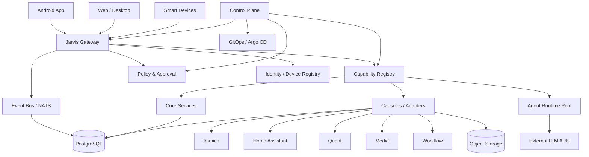

# Jarvis：AI 原生个人私有云整体规划方案

> 文档状态：Draft v1.0  
> 核心定位：**面向个人私有云、长期在线、事件驱动、可扩展、可治理的 AI 原生操作系统。**

## 1. 项目愿景

Jarvis 不是聊天机器人、不是 NAS、不是单机 Agent，也不是把多个开源服务简单拼在一起。

Jarvis 的目标是构建一朵**长期在线、属于个人、可被 AI 理解和操作的私有云**：

- 个人数据长期驻留在自己的基础设施中；
- 手机 App 是主要入口；
- AI 负责理解、规划、编排与解释；
- 具体服务负责确定性执行；
- 所有服务、设备、Agent 都通过统一消息与能力模型接入；
- 新开源应用可以低成本接入；
- 新 Idea 可以快速变成新能力或新服务；
- 系统能力不断增加，但核心复杂度尽量不增长；
- 高风险操作必须经过策略、权限与人工审批；
- 不运行本地大模型，大模型统一通过 API 调用。

## 2. 产品定义

Jarvis 可以被定义为：

> **Personal AI Cloud OS / AI 原生个人云操作系统**

核心长期稳定在三类能力：

1. **Message Gateway**：人、设备、Agent、服务之间的统一实时通信入口；
2. **Capability Registry**：系统拥有哪些能力、由谁提供、如何调用、风险等级如何；
3. **Control Plane**：身份、权限、审批、部署、架构治理、生命周期管理。

AI 是 Jarvis 中的一种“智能计算资源”，而不是所有请求的必经路径。

## 3. 核心设计原则

### 3.1 Cloud-Centric，而不是 Agent-Centric

错误方向：

```text
用户 → Agent → Tool → 所有系统
```

目标方向：

```text
用户 / 设备 / 服务
        │
   Jarvis Gateway
        │
 ┌──────┼─────────┐
 │      │         │
服务    Agent     事件
```

确定性请求直接调用服务；只有需要理解、推理、规划时才调用 Agent。

### 3.2 Stable Kernel + Disposable Extensions

Jarvis 核心必须保持小而稳定，只认识：

- Identity
- Device
- Message
- Event
- Capability
- Resource
- Policy
- Approval
- Lifecycle
- View

核心**不直接认识** Immich、Home Assistant、Freqtrade、n8n 等具体产品。所有外部应用通过 Adapter / Capsule 接入。

### 3.3 Capability First

系统以“能力”为核心，而不是以“App”为核心。

```text
photo.search
photo.upload
home.scene.activate
media.render
finance.portfolio.read
strategy.backtest
service.deploy
system.metrics.read
```

Capability Registry 将能力映射到 Provider：

```text
photo.search -> immich-adapter
home.scene.activate -> home-assistant-adapter
media.render -> media-worker
```

未来替换实现时，上层无需修改。

### 3.4 AI Native ≠ Everything Through AI

| 请求类型 | 执行方式 |
|---|---|
| 查询状态、打开页面、读取固定资源 | 确定性服务直接执行 |
| 模糊理解、复杂检索、解释 | Agent |
| 多步骤规划 | Agent + Workflow |
| 风险操作 | Agent/Service + Policy + Approval |
| 资金、删除、生产发布 | 强审批 + 审计 |

### 3.5 No Fork by Default

第三方开源应用接入优先级：

1. 官方 API
2. 官方 Plugin / Extension
3. Sidecar / Adapter
4. MCP / HTTP Adapter
5. 最后才考虑 Fork

### 3.6 Monolith First

自研业务默认模块化单体。只有出现独立扩缩容、故障域、资源模型、安全边界或明确性能瓶颈时才拆 Service。

### 3.7 Complexity Budget

新增依赖、服务、数据库、消息系统都必须说明必要性。Architecture Governor 持续检查：

- 重复 Capability
- 无用依赖
- 长期未调用接口
- Dead Code
- 过度抽象
- 不必要微服务
- 无所有者数据
- 无法卸载的扩展

## 4. 总体架构



## 5. 六个 Plane

### 5.1 Experience Plane

主要入口：Android App。

支持：

- Chat
- Voice
- Dynamic Dashboard
- Realtime Status
- Notifications
- Approval Center
- File Transfer
- Smart Home Controls
- Agent Monitoring
- Media
- Finance
- Service Views
- Dynamic UI Runtime

后续扩展 Web、Desktop、Wearable、车机、Smart Display。

### 5.2 Message Plane

核心：

- Jarvis Gateway
- WebSocket
- NATS / JetStream
- Event Stream

职责：

- 设备连接
- 用户会话
- Request / Response
- Realtime Event
- Streaming
- Presence
- Agent 状态
- 服务状态
- Approval
- Notification
- 数据传输控制消息

Gateway 必须保持“笨”，不承载 LLM 推理、Kubernetes 业务逻辑、交易逻辑和照片业务逻辑。

### 5.3 Intelligence Plane

AI 为可替换能力：

- Main Reasoner
- Ops Agent
- Coding Agent
- Research Agent
- Media Agent
- Quant Research Agent

Agent 可以按需启动：

```text
任务到达 → 创建 Worker / Pod → 完成任务 → 输出结果 → 销毁
```

长期在线的是云控制平面，不是所有 Agent。

模型统一调用外部 API：

- OpenAI
- Anthropic
- Google
- 其他兼容 Provider

不运行本地 LLM。

### 5.4 Service Plane

基础服务：

- System Service
- Message Service
- File Service
- Data Transfer Service
- Notification Service
- Agent Monitor
- LLM Usage Service

业务 Capsule：

- Immich / Photos
- Smart Home
- Media / Video
- Workflow
- Quant / Finance
- Android App Distribution
- Personal Data Modules
- Future Services

### 5.5 Data Plane

第一阶段保持简单：

- PostgreSQL
- Object Storage
- Event Store

后续确有需求再增加 ClickHouse、pgvector、专用 TSDB。

原则：

- 不允许跨服务直接访问别人的数据库表；
- 对外通过 Capability / API；
- 所有重要数据定义 Owner；
- 所有 Capsule 声明数据所有权与卸载策略。

### 5.6 Control Plane

负责：

- Identity
- Device Registry
- Capability Registry
- Capsule Registry
- Policy Engine
- Approval
- Audit
- Architecture Governor
- Service Factory
- GitOps
- Lifecycle
- Backup / Restore Coordination

## 6. 网络与访问

当前条件：

- 无固定公网 IP；
- 无域名；
- 不希望购买域名；
- 仅个人使用。

第一阶段采用：

```text
Android
   │
Tailscale
   │
Server
   │
Jarvis Gateway
```

公网 IPv6 是否变化不影响 Android 访问。

Jarvis 仍采集并展示：

- 当前公网 IPv4（如有）
- 当前公网 IPv6
- Tailscale IPv4
- Tailscale IPv6
- LAN IPv4
- 网络接口状态

## 7. Jarvis Gateway

建议统一 envelope：

```json
{
  "id": "01J...",
  "type": "request",
  "topic": "system.status.get",
  "source": "device/android-main",
  "target": "service/system",
  "timestamp": "2026-09-07T12:00:00Z",
  "payload": {}
}
```

消息类型：

```text
request
response
event
stream.start
stream.chunk
stream.end
approval.request
approval.response
presence
error
```

Gateway 必备：

- WebSocket 长连接
- Token / Device 身份认证
- Heartbeat
- Reconnect
- Sequence
- Idempotency
- Subscription
- Request timeout
- Streaming
- Server Push
- Presence
- Protocol Versioning

## 8. Capability Registry

示例：

```yaml
id: system.status.read
version: 1
provider: system-service
mode: request
risk: L0

input:
  type: object

output:
  type: object
  required:
    - cpu
    - memory
    - disks
```

模式：

- request
- job
- stream
- subscription

## 9. Capsule

目录：

```text
capsules/example/
├── capsule.yaml
├── adapter/
├── skills/
├── ui/
├── deploy/
└── tests/
```

Manifest 至少描述：

- ID
- Version
- Provider
- Capabilities
- Events
- Views
- Permissions
- Health
- Dependencies
- Data Ownership
- Backup
- Upgrade
- Uninstall

## 10. Service Factory

```text
Idea
→ Specification
→ Capability 重复检查
→ Module / Service 判定
→ Template
→ AI Coding
→ Test
→ Sandbox
→ Architecture Review
→ Security Review
→ Git Diff
→ Approval
→ GitOps Deploy
→ Capability Register
→ Dynamic UI
```

AI 不允许自由决定工程结构，只允许从 Golden Templates 创建。

建议模板：

- jarvis-module-ts
- jarvis-service-ts
- jarvis-worker-python
- jarvis-ui-module

## 11. Architecture Constitution

1. No duplicated capability.
2. No production shell for Agent.
3. No direct cross-service DB access.
4. No third-party fork by default.
5. New dependency requires justification.
6. New service requires isolation justification.
7. API must have schema.
8. Event must have schema.
9. Every extension must be removable.
10. Every persistent service must expose health.
11. Every production change must be auditable.
12. Dead code should be removed.
13. No abstraction before a real second consumer.
14. Prefer existing infrastructure.
15. Prefer boring technology.

## 12. 安全模型

| 风险等级 | 示例 | 处理 |
|---|---|---|
| L0 | 查看状态、日志 | 自动 |
| L1 | 创建相册、普通工作流 | 自动或轻提示 |
| L2 | 部署、重启生产服务 | App 确认 |
| L3 | 删除数据、开启实盘 | 生物识别 |
| L4 | 大额资金、永久删除关键资产 | 强审批 / 可选二次机制 |

Agent 永远不能直接获得：

- Production root
- Cluster Admin
- 全量 Secret
- 交易所 Withdrawal Key
- Backup Delete 权限

## 13. 智能家居

目标不是“语音开灯”，而是 AI 控制家庭状态。

能力：

```text
home.state.read
home.scene.activate
home.light.set
home.climate.set
home.lock.status
home.energy.read
```

建议通过 Home Assistant Adapter 接入。

## 14. 数据快传

目标：

```text
Phone ↔ Private Cloud ↔ PC / NAS
```

特性：

- LAN Direct
- Tailscale Direct
- IPv6 Direct（未来）
- Chunked
- Resumable
- Hash Verify
- Dedup
- Encryption
- Background Transfer
- Priority / QoS
- Transfer Event

能力：

```text
transfer.create
transfer.pause
transfer.resume
transfer.cancel
transfer.status
```

## 15. 可观测性

### 系统

- CPU
- Memory
- Load
- Disk
- Temperature
- GPU
- Network
- Uptime

### 服务

- Health
- Restart Count
- Latency
- Error Rate
- Version

### Agent

- Online / Offline
- Running / Idle / Error
- Current Task
- Provider
- Model
- Token
- Cost
- Latency
- Tool Calls

### LLM

按 Provider、Model、Agent、Capability、Day、Month 聚合：

- Input Tokens
- Output Tokens
- Cached Tokens
- Requests
- Errors
- Estimated Cost
- P95 Latency

## 16. 部署原则

### Genesis 层

宿主机级，尽量不允许 Agent 改：

- Linux
- Tailscale
- nftables
- NVIDIA Driver
- K3s
- Backup / Recovery

### Managed 层

GitOps 管理：

- Jarvis Gateway
- Jarvis Core
- PostgreSQL
- NATS
- Capsules
- Agents
- Monitoring

## 17. 第一阶段技术栈

| 层 | 推荐 |
|---|---|
| Host | Debian / Ubuntu |
| Private Network | Tailscale |
| Container | containerd |
| Orchestration | K3s |
| GitOps | Argo CD |
| Gateway | 自研轻量 Jarvis Gateway |
| Event | NATS / JetStream |
| Database | PostgreSQL |
| Backend | TypeScript 优先 |
| Worker | Python |
| Android | Kotlin + Jetpack Compose |
| Realtime | WebSocket |
| AI | 外部 API |
| Media | FFmpeg + RTX 5070 |

## 18. 里程碑路线

### M0 — Foundation

- Host
- Tailscale
- K3s
- Git
- PostgreSQL
- Gateway skeleton

### M1 — Always-On Personal Cloud

- Server 常驻
- Android 常驻连接
- 当前 IPv6
- 系统状态
- Agent 在线状态
- LLM Provider / Token Dashboard

### M2 — Capability Platform

- Capability Registry
- Event Bus
- Dynamic UI Schema
- Policy / Approval
- Audit

### M3 — First Capsules

- Immich
- Files
- Smart Home
- Media
- Workflow

### M4 — Intelligence

- Main Agent
- Ops Agent
- Coding Agent
- Provider Router
- Agent Events

### M5 — Service Factory

- Idea → Spec
- Template
- Sandbox
- AI Coding
- Architecture Governor
- Deploy

### M6 — Advanced Personal Cloud

- Quant
- App Distribution
- High-speed Data Transfer
- Family / Multi-device
- Capsule SDK

## 19. 项目成功标准

1. 手机随时可以访问私人云；
2. 云可以主动向手机推送状态和事件；
3. 没有 AI 时基本服务仍可用；
4. AI 可以理解并调用全局 Capability；
5. 新开源服务可通过 Adapter 接入；
6. 新 Idea 可以快速变成可运行 Module / Service；
7. 系统复杂度可度量；
8. 所有重要操作有审计；
9. 任意 Capsule 可以安全卸载；
10. 核心 Kernel 长期保持小而稳定。

## 20. 一句话总结

> **Jarvis 是一朵属于个人、长期在线、通过统一 Gateway、Capability 与 Control Plane 连接数据、服务、设备和 AI 的云原生操作系统。**
